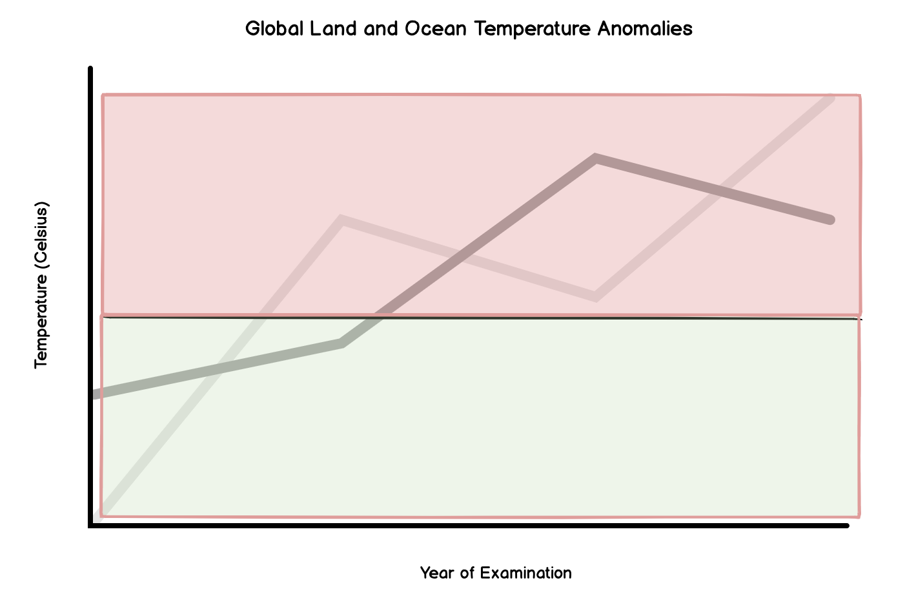
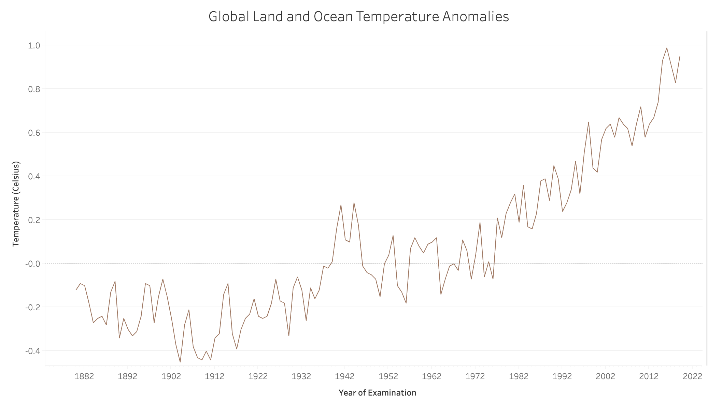

# lahoti_portfolio
This is my portfolio for Telling Stories With Data

# About Me
Hello! I am currently a Master of Information Systems Student at Carnegie Mellon University. My pronouns are he/him/his. I am originally from Phoenix, Arizona and went to ASU for my undergraduate studies. I took mostly computer-science or advanced mathematics classes at ASU, and therefore decided to join the MISM program here at CMU. For fun, I enjoy hiking and finding new places to eat around my area! I am also an avid Netflix watcher and the biggest fan of "The Office"!

# What I hope to learn
I have always been intrigued in demonstrating trends and patterns utilizing large sets of data. However, doing this in an aesthetic, efficient manner has been difficult for me. To elaborate, I tend to either add to much to my visualizations or too little. I want to be able to support my ideas and thoughts with meaningful, concise graphic visuals to paint a useful picture for my audience! Furthermore, I plan to go into the field of consulting, in which describing data through charts, graphs, and other graphics plays a key role in helping clients solve problems. This class will provide me a toolbox to leverage when creating these presentation visualizations. Lastly, although I have never worked with Tableu in the past, I know how useful of a software it is! Therefore, I am very much looking forward to delving into that tool and becoming better at Telling Stories with Data!

# Portfolio
My data visualizations will be added in this section!

[DataViz](/dataviz2.md)

[Final Project](/final_project_VedantLahoti.md)

[Part 2 of Project](/parttwofinalproject.md)

[Part 3 of Project](/partthreefinalproject.md) 

Critique by Design Assignment

Original Visualization: https://www.ncdc.noaa.gov/cag/global/time-series/globe/land_ocean/ytd/12/1880-2019

I chose this visualization because I find the message of the graph fascinating. Although people discuss global temperature changing over the years, this graph attempts to display the significant change. Furthermore, this is a very widely discussed topic in society. Because the visualization speaks to a topic that is of such important, I wanted to delve into the data and attempt to make the message clearer. Although the graph delivers the message of increasing temperature rates somewhat effectively, I think a great deal can be done to make the visualization clearer and tell the story more succinctly. 

User Feedback:

What does this look like to you?

Person 1: It looks like relationship between temperature and year of ocean and land temperatures.
Person 2: It looks like an increasing graph over a certain time span that is also has interloping lines. 

Do you see any trends from the information presented?

Person 1: I do not understand why there are two different lines in the wireframe illustration
Person 2: The data presented is not in one region, and seems to change its overall position in the visualization.

Are there any suggestions you would give me?

Person 1: I would possibly remove the different colored regions and add numeric value to the middle line (dividing both regions).
Person 2:  think the green and red regions don’t seem to add value or make sense in the context of this graph.

What do you think it is meant for?

Person 1: I would add discrete values to the x-axis, as it is currently confusing.
Person 2: This graph possibly demonstrates the effect of global warming on land and ocean temperatures.

My Process: 

When I first saw the data visualization, I had trouble understanding the message trying to be conveyed. Upon closer inspection, I realized the graph was displaying the change in global weather conditions over the years, highlighting the fact that the weather has been increasing over the years. To elaborate, I was initially confused as to the colors utilized in the chart, but then understood that anything above the “0 degrees mark” was an anomaly (consequently in red). One aspect I wanted to work with was the color aspect of the visualization. Additionally, I thought the graph was difficult to comprehend due to the type of visualization chosen. Although the bar chart displayed the data comprehensibly, I thought there was surely a way to make the data points appear clearer and remove excess noise from the graph. 
After initially examining the visualization, I created a wireframe from Balsamiq to sketch out a rough idea of my new version. I then showed two individuals my wireframe to ask about their opinions. They both did not think there was a need to have color in the first place. Indeed, both individuals said that the message of the graph is clear without color—color just adds unnecessary noise. However, both seemed to understand the overarching purpose of the graph—to illustrate changing climate over the years. I then began recreating the visualization using Tableau. 
The first change I made was converting the bar chart format to a line chart. In doing so, the points appeared clearer and the message of the visualization (that weather is increasing over the years) was still presented effectively. In addition, I removed the color from the graph, as it did not serve any real purpose. Lastly, I decided to not make the area shaded in my new visualization. I felt like adding shading would not supplement the group but would instead add more confusion. My final visualization is presented below (along with the original visualization):

Wireframe:

New Visualization:

