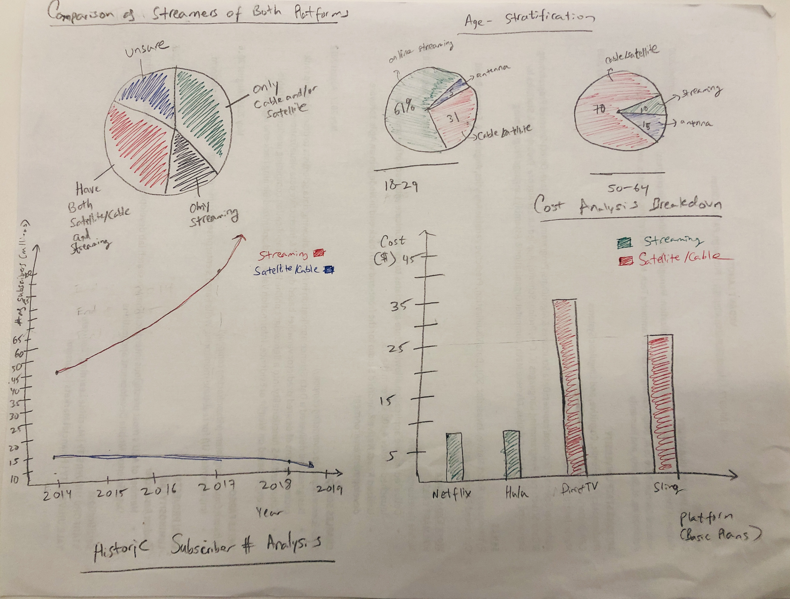

[Back](https://vlahoti.github.io/lahoti_portfolio/)
# High-Level Summary of my project:

My project will take a deep dive into the demise of the cable and satellite industry due to streaming platforms that offer a great deal of value. This analysis will examine the statistics relating to the decline of cable and satellite companies such as Dish Network or DirectTV and describe data relating to the continued progress of streaming companies such as Netflix, Hulu, and Amazon Prime. 

Project Structure (Divided into 4 steps) :

1) Discuss the number of people subscribed to both types of platforms

2) Delve into the age-stratification of user subscription
	-Highlight the difference in subscription when considering age group

3) Discuss the historic change of user subscription from both types of platforms
	-Compare a popular streaming platform such as Netflix with a popular satellite platform such as Dish Network
3) Examine Cost as an additional reason for this difference
	-Compare highly utilized satellite platforms (DirectTV, Sling) with streaming platforms such as Netflix, Amazon Prime, and Hulu

# Initial Sketches

# The Data:

I will be utilizing four different data sources for this project. The first source of data discusses overall statistics of consumer usage of both streaming and cable/satellite subscription. This data will paint a general picture of the situation. This data describes how many people are subscribed to cable/satellite, to streaming services, and to both. The next data source delves into usage deriving from various age groups. Specifically, this takes into consideration the younger generation, adults, older individuals, and the elderly. I plan to illustrate both of these data sources with pie charts.

The third and fourth sources of data I will utilize describe the change in number of people who are subscribed to both respective types of platforms over the years. I decided to utilize two specific companies within both industries to analyze the data more meaningfully. The two companies data I decided to utilize are Netflix and Dish.  The final data source I will be using delves into another aspect of the situation—cost. This data describes the respective costs of both platforms. I will be using a line chart that changes over time (a video-type visualization) and a bar chart for these data sources.

Data Sources: 
 How many people have streaming, just cable, or both:
https://www.cnbc.com/2018/03/29/nearly-60-percent-of-americans-are-streaming-and-most-with-netflix-cnbc-survey.html

Age is factor (how many people watch what):
https://www.pewresearch.org/fact-tank/2017/09/13/about-6-in-10-young-adults-in-u-s-primarily-use-online-streaming-to-watch-tv/ft_17-09-13_streaming-1/

Number of people who use Netflix over the years:
https://www.statista.com/statistics/250934/quarterly-number-of-netflix-streaming-subscribers-worldwide/

Number of people subscribed to Dish:
https://www.statista.com/statistics/497299/dish-network-number-subscribers-usa/

Costs of both platforms:
https://www.bankrate.com/personal-finance/smart-money/cost-of-cable-tv-vs-internet-streaming/

# Method and Medium:

I plan on utilizing Shorthand to present this project. The first stage of this project will be to give readers a general picture the situation, in terms of how many people are subscribed to cable, streaming services, or both. I will utilize a bar chart visualization to do this. Next, I will go into the more specific aspects of this subject. I think it makes sense to stratify consumers by age-bracket to illustrate a clearer picture of who actually uses which platform. Therefore, I will depict data coming from two differently aged groups: those who are between the age bracket of 18 to high 20’s and those between the age of 50-65. I chose to describe these two groups because their difference in age is so starkly different and it would help illustrate the lack of similarity in content viewership.

I then plan to use historical data of both platforms to depict the change in user subscription over the years. I chose to use Netflix as my streaming platform and Dish as my cable/satellite platform for this goal. I will illustrate the data (describing the amount of users over the years) using a moving line chart. The tool I will use to accomplish this is Gapminder. This aspect will show that as time changes, how one platform’s user subscription has greatly increased, while the other’s has severely decreased. 

Lastly, I will delve into another large aspect as to why cable/satellite has been failing over the years. Cost is a key factor in differentiating both platforms. I will create a bar chart and compare a few of the streaming companies’ cost with a few of the cable/satellite companies’ costs (I will utilize the most basic package for each of the companies). By displaying these four visualizations in meaningful ways, this data story will describe how the streaming industry has taken over the cable/satellite industry in entertainment.

