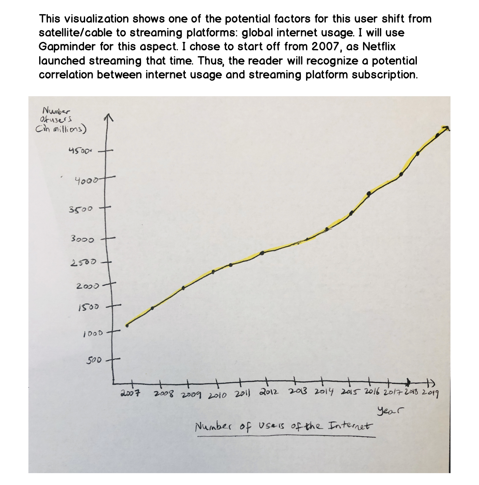
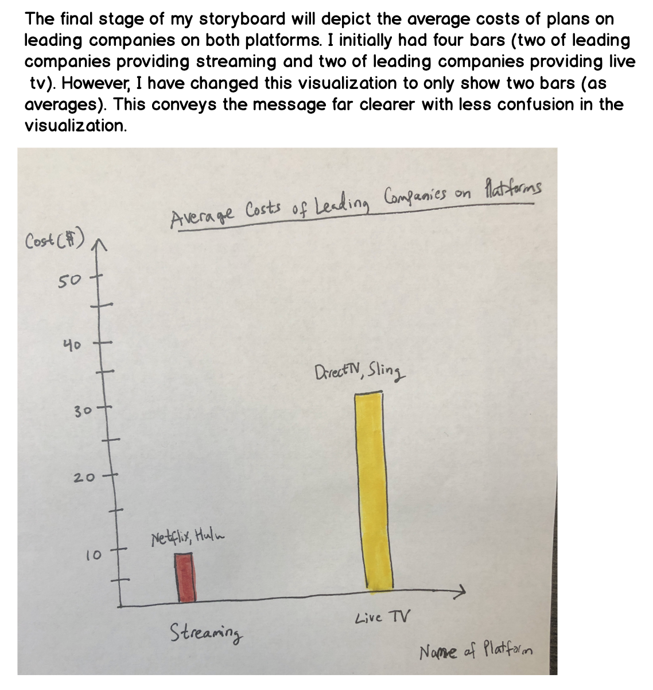

# Initial Wireframes/Storyboard for User Feedback

# User Research Protocol, Interviews, Reflection on Interviews and Feedback

Target Audience: 
When conducting my research protocol, my target audience was individuals who were interested in seeing how entertainment content viewership has changed over the years. In today’s day and age, because such a great deal of content is published online, analyzing different aspects about this topic and recognizing factors that may have contributed to this change (through effective visualizations) would be fascinating for this audience. 

Approach to identify interviewees:
I wanted to interview people from different locations, with different educational focuses. Therefore, I chose an individual in my program at Heinz (studying Information Systems Management), and individual from the University of Pittsburgh (studying a Healthcare-related field), and a working individual from my apartment complex (who has a background in fashion). 

Interview script:
My interview script was as follows:

“When looking at these visualizations, are you able to see the message I am trying to convey? Are there any visualizations you think need work or should be reconstructed? Do you think it makes sense to add any further graphs to better tie together the data story?” 

From this script, I received extremely useful feedback, ranging from recommendations regarding my visualization choices to restructuring of wireframes.

Findings:
The findings I received was as follows: 

Interviewee 1:

1. For bar chart describing costs, why have two of each platform, average the cost of most used three of each platform and just have one bar.
2. For the first chart, combine two categories to show the vastness of streaming. Do this by combining the categories “only streaming” and “both satellite/cable & streaming” as “streaming”. This is because if they have “satellite/cable & streaming”, they also just have streaming. This conveys the point clearer.
3. Add another chart that is a historic line chart, displaying how over time, different regions of the world have gotten more access to internet. This would give more reason as to why streaming has increased over time. 

Interviewee 2:
1. Add percentages to the first pie chart. This will add more specificity to the data being presented through the pie charts.
2. Convert the second pie chart in to bar charts. This would highlight the differences more clearly between different age-groups.
3. Possibly add a chart that number of viewership content available on both platforms. If one has far more, this is one of the reasons for a switch.

Interviewee 3:

1. Restructure order of wireframes and visualizations. This is because it makes sense because you need more of a background and then data visualizations that show factors influencing this pattern.
2. Change the second visualization into a bar chart, as it would more clearly demonstrate the differences in preference between both age groups. This would be more effective than using two pie charts.
3. Add a world map that highlights where each type of platform is being used more. Doing this may provide insight into the shift from cable and satellite to streaming online. 

Changes implemented

One of the issues I realized from the feedback was that the order of the visualizations was not very clear, and did not properly convey the end-message of the story. Therefore, I restructured the order of my storyboard by breaking it up into two larger sections: background and factors. The background aspect explains the statistics related to historical data, stratification data, and general usage data of the topic. The next section goes into data visualizations that better explain the reasons for this shift from satellite/cable tv to streaming: increase in global internet usage and cost. Additionally, I decided to change the second part of the visualization from two pie charts to one bar chart with two sets of data. This helps highlight the differences in data more vividly. Moreover, I decided to change the cost-analysis bar chart (based on the advice of an interviewee) to two individual bars, that had cost/plan averages of leading companies on each platform. An interviewee suggested that I add a graph that demonstrates how internet usage has changed over the years, being a reason why streaming has also increased over the years. Therefore, I added a visualization that demonstrates this trend, starting form 2007 (when Netflix launched streaming) to 2019. This line chart will use  Lastly, I decided to combine the categories “only streaming” and “both satellite/cable & streaming” to “streaming”. Indeed, doing this accurately depicts the extent of how many users are subscribed to streaming (when compared to those subscribed to just cable/satellite). I believe with these changes, additions, and restructuring, my data story is a lot clearer and effective.

# Revised wireframes/ visualizations/ storyboards

Source of data: https://www.internetworldstats.com/emarketing.htm

